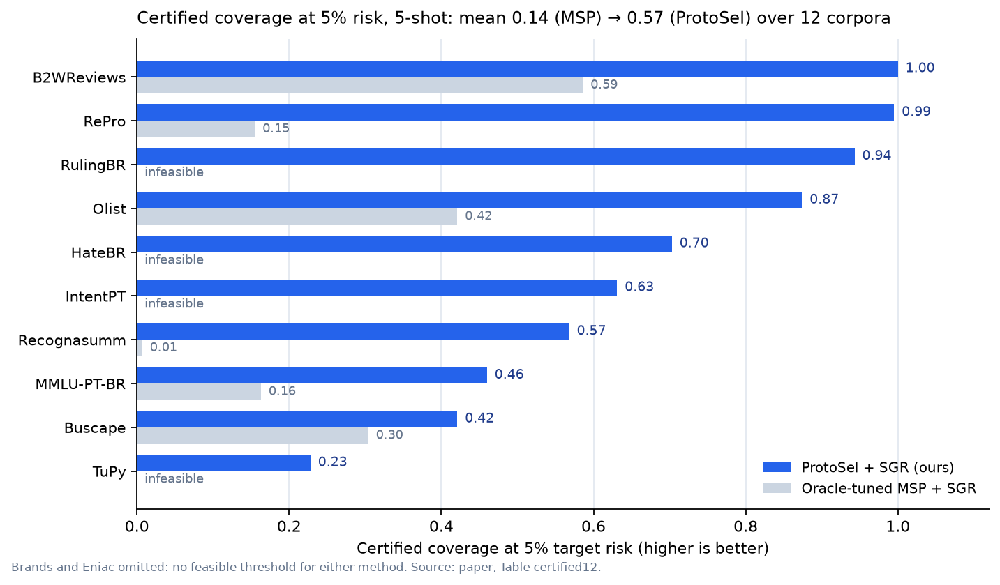
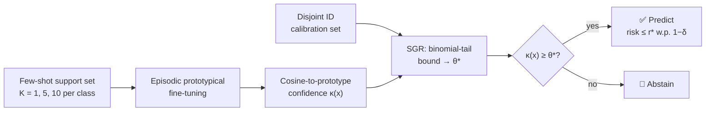

<div align="center">

# Selective Risk Framework

**Few-shot text classifiers that know when they don't know, with a statistical guarantee on the error rate of the predictions they keep.**

🇺🇸 **English** · 🇧🇷 [Português](README.pt-BR.md)

[](https://beatrizalmeidaf.github.io/selective-risk-framework/)
[](https://www.python.org/)
[](https://pytorch.org/)
[](LICENSE)
[](https://github.com/beatrizalmeidaf/selective-risk-framework/stargazers)

[**Project page**](https://beatrizalmeidaf.github.io/selective-risk-framework/) ·
[**Paper (LaTeX source)**](docs/conferences/ACL/paper.tex) ·
[**Quickstart**](#-quickstart) ·
[**Results**](#-key-results) ·
[**Cite**](#-citation)



</div>

---

## Why this exists

With only **1, 5 or 10 labeled examples per class**, text classifiers are confidently wrong. Their confidence scores can't tell correct predictions from errors. If you ask for *"at most 5% errors on the answers you give"*, a standard pipeline often can't find **any** threshold that meets the target, so it has to answer nothing.

This repository shows that the fix lies mainly in the **representation**, not in a smarter confidence score:

1. **Episodic prototypical fine-tuning (ProtoSel)** reshapes the latent space so that distance to a class prototype actually ranks errors.
2. **SGR (Selection with Guaranteed Risk)** turns that score into a threshold θ\* with a PAC-style certificate: `Pr(selective risk > r*) < δ`.
3. The model **abstains** when confidence < θ\*. It returns an answer only when it can keep the stated risk bound.



## Key results

12 Portuguese corpora (reviews, hate speech, legal rulings, intents, MMLU-PT, …), 5-shot, mean over 5 folds. Baselines: 7 post-hoc scorers (MSP, Energy, ReAct, ConjNorm, GradNorm, Mahalanobis, kNN), with the strongest one tuned by **oracle hyperparameter search**.

| | Oracle-tuned MSP | **ProtoSel (ours)** |
|:---|:---:|:---:|
| Corpora with the lowest AURC | 0 / 12 | **12 / 12** |
| Median AURC reduction | — | **−67%** |
| Mean certified coverage @ 5% risk | 0.14 | **0.57** |
| Mean certified coverage @ 10% risk | 0.28 | **0.73** |
| RulingBR (legal): certified coverage @ 5% risk | infeasible | **0.94** |
| ID accuracy gain | — | **+3 to +45 pp** |

**Representation or score?** A 4×2 factorial study (frozen / cross-entropy / SetFit / prototypical encoder × MSP / cosine score) shows that changing the **representation** moves accuracy-invariant metrics **6–24× more** than swapping the confidence estimator on top of it. SetFit, even with tuned hyperparameters, falls behind and degrades sharply at 1-shot.

**Honest limitation:** the SGR certificate holds **in-distribution only**. When unseen classes enter the stream, the same threshold reaches **15.2% empirical error** against a 5% target on the worst of five corpora. We report this failure mode on purpose. See the paper and the [project page](https://beatrizalmeidaf.github.io/selective-risk-framework/) for all 18 tables.

## What's inside

| Module | What it gives you |
|:---|:---|
| [`methods/laqda/`](methods/laqda/) | Episodic prototypical encoder (label-aware cross-attention, QDA sampler, contrastive loss), train/infer CLIs |
| [`methods/sgr/`](methods/sgr/) | **SGR** threshold search with a binomial-tail risk bound: reusable on any confidence score |
| [`methods/baselines/`](methods/baselines/) | MSP, Energy, **ReAct**, **ConjNorm**, **GradNorm**, Mahalanobis, kNN: post-hoc OOD / confidence scorers |
| [`methods/metrics/`](methods/metrics/) | One suite for AURC, E-AURC, risk-coverage curves, risk@coverage, AUROC, FPR@95, AUPR-in/out, ECE, SGR coverage |
| [`data/`](data/) | Deterministic ID/OOD splits, k-shot episodic samplers, Lightning-style datamodules |
| [`scripts/`](scripts/) | SLURM launchers for the full benchmark, cross-fold aggregation and plots |

## Quickstart

```bash
git clone https://github.com/beatrizalmeidaf/selective-risk-framework.git
cd selective-risk-framework
make setup-env && source .venv/bin/activate   # installs uv + all dependencies
# or: make laqda-install && docker compose up laqda   (GPU container)
```

Put the corpora under `data/datasets/datasets-br-nlp/` (or `datasets-en-nlp/`), then build the deterministic ID/OOD splits:

```bash
python main.py            # writes configs/ood_splits.json
```

Train a 5-shot ProtoSel model **with the SGR certificate** (5% target risk):

```bash
python -m methods.laqda.cli.train \
    --dataset_dir data/datasets/datasets-br-nlp/intent/IntentPTCorpus/few_shot \
    --fold 01 --kshot 5 --use_sgr \
    --save_dir outputs/laqda_sgr/IntentPTCorpus/fold_01
```

Run all 7 post-hoc baselines on the same split:

```bash
python -m methods.baselines.cli.train_baseline \
    --dataset_dir data/datasets/datasets-br-nlp/intent/IntentPTCorpus/few_shot \
    --fold 01 --kshot 5 \
    --save_dir outputs/baseline/IntentPTCorpus/fold_01
```

Aggregate across folds and plot AURC vs. SGR coverage:

```bash
python scripts/compare.py --corpus IntentPTCorpus --plot
```

<details>
<summary><b>Full benchmark on a SLURM cluster</b></summary>

```bash
bash scripts/run_all_pt.sh   # Portuguese corpora
bash scripts/run_all_en.sh   # English corpora
squeue -u $USER              # monitor
```

The scripts submit every method (baselines, kNN-contrastive, ProtoSel, ProtoSel+SGR) × folds 01–05 × k ∈ {1, 5, 10}, one H100 per job. Logs go to `outputs/logs_slurm/{pt,en}/`.
</details>

<details>
<summary><b>Makefile shortcuts</b></summary>

| Command | Description |
|:---|:---|
| `make setup-env` | Create `.venv` and install dependencies with `uv` |
| `make laqda-install` | Build the Docker image |
| `make test-baselines` | Run unit tests for scorers and metrics |
| `make run-pipeline` | Launch the full PT + EN benchmark on SLURM |
| `make laqda-eval` | Consolidate metric reports |
| `make laqda-lint` / `make laqda-clean` | Syntax check / remove caches |
</details>


## 📄 License

[MIT](LICENSE)
